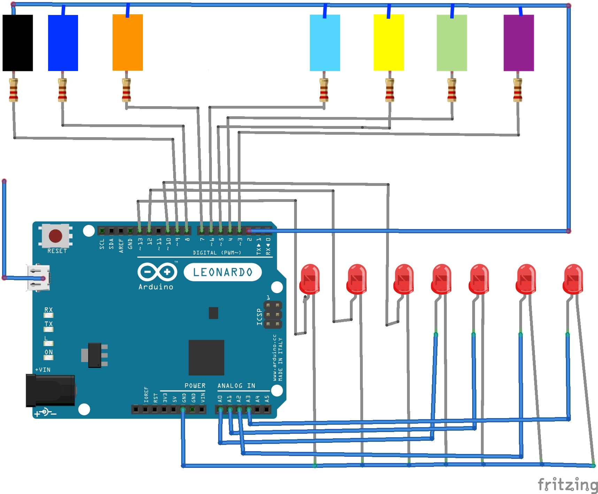

# keybored

### [1] tl;dr if you want to fire it up now
Assuming that you have the dependencies installed:

Clone or download the repository.

Run the following:
```
$ cd to the download directory
$ export FLASK_APP=application.py
$ flask run

* Serving Flask-SocketIO app "application.py"
* Forcing debug mode off
* Serving Flask app "application.py"
* Environment: production
 WARNING: Do not use the development server in a production environment.
 Use a production WSGI server instead.
* Debug mode: off
* Running on http://127.0.0.1:5000/ (Press CTRL+C to quit)

now go to http://127.0.0.1:5000/
```

and voila! The application is served.

In case any error shows up, it should be because you do not have [flask](http://flask.pocoo.org/docs/1.0/installation/) installed. Follow the installation instructions. If any other errors show up go [here](https://www.google.com/).

***Please note that the above will only allow you to play using the keyboard and mouse. For playing via the Arduino CapacitiveTouch integration you need additional setup as below:***

### [2] Integrating the Arduino CapacitiveTouch
***Note***: This circuit will work only with the following Arduino types: Leonardo, Esplora, Zero, Due and MKR family. We tested with Arduino Nano, it didn't work :P. So, use Leonardo or the like.
```
* Wire the circuit as shown:
```

```
* Download the CapacitiveSensor library in your Arduino IDE.
* Open touch.ino
* Upload the code
* Now follow [1]
```
